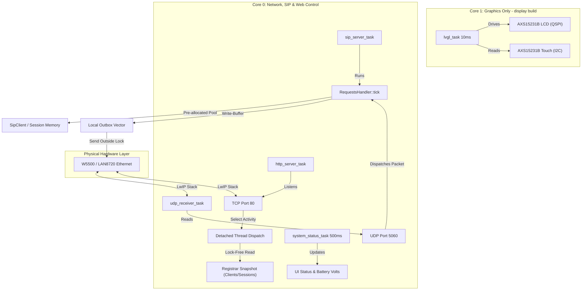

# Pocket-Dial ESP32 Firmware: Deep Architectural Review

This document provides a highly technical, deep architectural analysis of the **pocket-dial** firmware. It reviews the post-refactor system topology, multi-core scheduling paradigm, component communication boundaries, select-based HTTP thread dispatching model, and concurrency optimizations.

## 1. System Topology & Component Overview

**pocket-dial** is an ultra-low-latency, dual-core SIP registrar and back-to-back call broker designed to run on resource-constrained ESP32 and ESP32-S3 microcontrollers. It supports multiple networking interfaces (Wi-Fi SoftAP/Station and SPI/RMII wired Ethernet) and drives smart displays (e.g., JC3248W535) using the LVGL graphics library.

The firmware architecture is divided into three core logical layers:
1. Network Hardware & Driver Layer: controls physical media (Wi-Fi radio, W5500 SPI Ethernet MAC/PHY, LAN8720 RMII PHY) and registers low-level event handlers.
2. Signaling & State Engine Layer (`RequestsHandler`): A lightweight SIP registrar and session controller managing client registration leases, active SIP sessions, and intercom broadcasting/paging features. It implements a deliberately partial subset of RFC 3261; §1.2 states exactly which transactions exist and which do not.
3. User Interface & Query Layer: consists of a custom select-based, thread-dispatching `HttpServer` serving a retro CGA CRT web dashboard, an mDNS service responder, and a high-frequency LVGL-based GUI display task.

The diagram below shows the **display (JC3248W535) build**, where Core 1 is reserved for
LVGL and everything else is on Core 0. On the headless `eth` build there is no `lvgl_task`
and both `sip_server_task` and `udp_receiver_task` move to Core 1 instead. The two are
**always co-located** on the same core (`handle()` runs inline on the receiver task), so
no build splits them the way an earlier revision of this diagram did.



### 1.1 Protocol Role: Back-to-Back Call Broker, Not a Proxy

> [!IMPORTANT]
> **`RequestsHandler` is not an RFC 3261 §16 proxy, and the distinction decides
> where the audio goes.** A proxy forwards a request onward along a route set; this
> engine terminates each call leg and originates the next one itself.

The clearest evidence is in what the outbound path never writes:

- **No `Record-Route`, ever.** The header does not occur anywhere in `src/`. The box stays reachable for in-dialog traffic by rewriting `Contact` to point at itself on each leg (`CallForker::buildInviteFork`, `CallForker.cpp:28`), a user agent's mechanism, not a proxy's route set.
- **No `Via` stacking.** Requests the PBX *originates* carry exactly one `Via`, its own, bearing its own branch (`buildInboundInviteFork`, `buildInboundCancelTo`, `ackInboundFinal`; `BlfSubscriptions.cpp:126`; `ParkOrbit.cpp:155`; `RegisterBeeper.cpp:75`). The ordinary extension-to-extension INVITE (`CallForker::buildInviteFork`, `CallForker.cpp:22-50`) is not rewritten in that respect at all: it is a verbatim copy of the caller's message with only the Request-URI, `To` and `Contact` replaced, so it reaches the callee carrying the caller's own `Via` with none of ours pushed on top. Responses are generated as a UAS (the request's `Via` echoed back with `received=` / `rport` filled in per §18.2.1, via `sipwire::viaWithReceived`) and are never forwarded upstream by popping a `Via` off a stack.
- **`Max-Forwards` is write-only.** It appears solely as the literal `Max-Forwards: 70` on outbound requests, and is never read, tested or decremented on any inbound path. The §16.6 loop protection a proxy owes the network is therefore absent by construction.
- **`Route` is neither honoured nor stripped.** `SipMessage` has no concept of the header, so a `Route` a phone puts on a request simply rides along inside the relayed copy.

What the engine *is* instead is a forked UAC coupled to a UAS, what `docs/FEATURE_ROADMAP.md:57` calls a **back-to-back call broker**. Two distinct leg shapes share that label, and the difference surfaces in every header a debugger looks at:

- **Legs the PBX originates** (the inbound-trunk fork, park ring-back, register beep, BLF `NOTIFY`) are a fresh UAC: its own `Via` and branch, its own `From`-tag, and a `CSeq` space restarting at 1, while reusing the caller's `Call-ID` (`buildInboundInviteFork`).
- **Ordinary extension-to-extension legs** are the wholesale copy described above, so `From` (tag included), `CSeq` and `Via` all reach the callee exactly as the caller wrote them. Keeping the caller's `Via` is what lets the return path work without a second rewrite: the callee's `180`/`200` already bears the `Via` the caller expects, so the relay hands it straight back with only `To` and the codec list touched (`onOk` → `endHandle`, which merely enqueues to the destination).

Either way the caller's `Call-ID` spans both legs. That is deliberate rather than sloppy: it is the `_sessions` key, which is how a mid-dialog request arriving from *either* leg resolves to the one session via `getSession(data->getCallID())`.

Unlike a textbook B2BUA, it does not insert itself into the media path. SDP is relayed with only unsupported codecs filtered out, so an ordinary extension-to-extension call streams RTP directly phone-to-phone and the board never handles a media packet. The exceptions (`440`, `888`, `555` and outside lines) are tabulated under "Audio: what touches the board, and what doesn't" in the README. **Add two the README table did not used to list: a call sitting on a park orbit when a music-on-hold clip is loaded (`ParkOrbit.cpp:56-75` answers the parked leg `sendonly` from the `HoldMusic` port, and `HoldMusic` then transmits to it every 20 ms), and the dashboard's MoH preview call (`RequestsHandler.cpp:2035-2064`), which rings an extension purely to play the clip at it.** Park with no clip loaded (the default) still answers `a=inactive` and sources nothing.

### 1.2 Transaction-Layer Scope

`TransactionLayer` implements the full RFC 3261 §17 transaction layer: four
transaction types across two pools (`TransactionLayer.hpp:14-37`). The
**client pool** covers requests this PBX sends and retransmits until
answered; the **server pool** covers responses this PBX authors, kept so a
retransmitted request gets the same answer back and (for INVITE)
retransmitted until it is ACKed. `classify()` is the single router that
decides which of the four a message earns, and it is method- and
authorship-aware rather than blanket: every INVITE **response** this PBX
itself authored becomes an `InviteServer` transaction, `BYE`/`CANCEL`/
`REFER`/`UPDATE` responses it authored become `NonInviteServer`, every
INVITE **request** it sends becomes `InviteClient`, and every other request
it sends — `BYE`, `CANCEL`, `NOTIFY`, `REFER`, `INFO`, `MESSAGE`,
`SUBSCRIBE`, `UPDATE` — becomes `NonInviteClient` (`TransactionLayer.cpp:79-116`).
This landed in PR #226.

Implemented today:

| Mechanism | Where |
| :--- | :--- |
| §17.1.1 INVITE client transaction (Timer A retransmit from `T1` = 500 ms, doubling uncapped; Timer B at 64×T1 = 32 s) | `TransactionLayer.cpp:110`, `sweep()`/`sweepOne()` |
| §17.1.2 Non-INVITE client transaction (Timer E, T1 doubling capped at `T2` = 4 s; Timer F at 32 s; Timer K at `T4` = 5 s) for every non-INVITE request the PBX sends other than `ACK`/`OPTIONS`/`REGISTER` | `TransactionLayer.cpp:101-116` |
| §17.2.1 INVITE server transaction — Timer G/H for a non-2xx final, plus §13.3.1.4 retransmission of a **2xx until ACKed** (RFC 6026 §7.1 Timer L once it is) — for an INVITE response this PBX authored | `TransactionLayer.cpp:79-85`, `:329-349` |
| §17.2.2 Non-INVITE server transaction (Timer J response cache, no retransmit schedule) for an authored `BYE`/`CANCEL`/`REFER`/`UPDATE` response | `TransactionLayer.cpp:86-98`; sizing rationale in `PoolConfig.hpp:355-367` |
| §17.2.3 duplicate-request suppression: a retransmitted request matching a tracked server transaction is answered from the stored response and the handler is **not** re-run | `TransactionLayer::absorbRetransmittedRequest`, called from `handle()` at `RequestsHandler.cpp:915-922` |
| §17.1.1.3 ACK for a non-2xx final to a PBX-originated INVITE | `ackInboundFinal`, `RegisterBeeper::handleInviteFailure` |
| §18.2.1 `received=` and RFC 3581 `rport` on every response | `sipwire::viaWithReceived` |
| §12.2 To-tag detection routing a re-INVITE onto the hold/resume path | `RequestsHandler::onInvite`, `RequestsHandler.cpp:1606-1611` |
| §11.2 capability discovery (`Allow` / `Supported` / `Accept` / `Allow-Events`) | `addCapabilityHeaders()`, called from four sites: `onRegister`'s 200 OK (`RequestsHandler.cpp:1257`), `onOptions`'s 200 OK (`:1377`), the anchored-media re-INVITE/UPDATE answer shared by `onReinvite()`/`onUpdate()` (`answerAnchorReinvite`, `:8356`), and `buildOkWithSdp()` for every PBX-authored 2xx to an INVITE — the 888 conference leg, the 555/anchor bridge, the inbound-anchor handset leg (`:8941`) |

Real limitations, not stale ones — worth knowing before debugging a retransmission:

- **Only responses this PBX itself authors get a server transaction.** An ordinary extension-to-extension call has its 200 OK **relayed** verbatim from the callee phone (`authoredHere()`, `TransactionLayer.cpp:55-64`); that phone is the real UAS and is already retransmitting its own 200 under its own transaction layer, so retransmitting it here too would just double the packets on the wire on a loss. This is also why the server pool (`POCKETDIAL_MAX_SERVER_TRANSACTIONS`) is sized so much smaller than the client pool (`POCKETDIAL_MAX_TRANSACTIONS`) — only virtual extensions, anchor/bridge legs and PBX-minted failure responses ever claim one (`PoolConfig.hpp:330-372`).
- **A retransmitted INVITE on an already-`Connected` dialog can still be silently dropped**, exactly as it was before this layer existed — but now only in the cases the layer does not cover: the relayed-response case above (no server transaction was ever opened), and an authored dialog that has already reached the `Accepted` state, where the retransmission is deliberately **not** answered from the absorb cache (`TransactionLayer.cpp:507-531`) because the automatic 2xx-retransmit timer is expected to be the reliability mechanism there instead. Either way it falls through to `onInvite()`'s pre-existing "Task 2A" guard, unchanged (`RequestsHandler.cpp:1597-1618`).
- **A 2xx to an INVITE that is never ACKed is not followed up with a BYE.** §13.3.1.4 says the UAS SHOULD tear the dialog down once it gives up retransmitting; this layer instead logs the give-up and frees the slot, leaving the dialog itself untouched — a TU-level decision tracked as a follow-up on #199 (`TransactionLayer.cpp:584-594`).
- **Both pools are fixed-size and degrade rather than block.** When every slot is busy, claiming one fails and the message is still sent once, just with no retransmit/absorb coverage for it — precisely the pre-#226 behaviour for that one message (`TransactionLayer.cpp:251-257` client, `:301-310` server).
- **A message too large to fit `POCKETDIAL_TX_MSG_BYTES`** (1500 bytes, the Ethernet MTU) is stored truncated and is never retransmitted, logged once at claim time so the gap is visible rather than silent (`TransactionLayer.cpp:136-152`).
- **`INFO` is deliberately excluded** from the non-INVITE server set even though a duplicated DTMF digit from a retransmitted `INFO` is a real bug: a 32 s Timer J slot per keypress would dominate the server pool on its own. Tracked separately (`PoolConfig.hpp:361-367`).
- **`OPTIONS` keepalives, outbound `REGISTER`, `ACK`, and relayed responses stay outside this layer by design**, not by gap: loss of an `OPTIONS` probe **is** the liveness signal it exists to produce, `REGISTER` already runs its own §10.2 refresh/retry schedule in `SipRegistrationClient`, and an `ACK` is never a transaction of its own under §17.1.1.3 (`TransactionLayer.hpp:39-63`).
- **Timer granularity is coarser than the RFC's millisecond figures.** `sweep()` is driven from `RequestsHandler::tick()`, which self-throttles to 1 Hz, so a `T1` = 500 ms first retransmit actually lands around 1 s later. This predates the transaction layer and is conservative under §17 — fewer retransmits on the wire, never more (`TransactionLayer.hpp:64-71`).

The practical upshot: INVITE — client and server, including the
2xx-retransmit-until-ACK half a UAS owes under §13.3.1.4 — and the four
non-INVITE methods where re-running the handler on a duplicate does real
damage (`BYE`, `CANCEL`, `REFER`, `UPDATE`) now get RFC-conformant retry and
duplicate suppression, so a single dropped UDP datagram carrying a
PBX-originated `BYE` **is** retried by this engine, the same as a
PBX-originated INVITE. What is left uncovered above is either an
intentional scope boundary (a relayed response, an `OPTIONS` ping,
`REGISTER`, `ACK`) or a specific, logged degrade path (pool exhaustion, an
oversized message, an unACKed 2xx) — not a missing layer.

## 2. Core Task Topology & Affinity Splits

To prevent render frame drops and network packet loss, **pocket-dial** enforces a strict core affinity split that isolates real-time communication tasks from CPU-intensive graphics rendering.

The system assigns FreeRTOS tasks to specific cores using `xTaskCreatePinnedToCore`:

### Core Affinity Allocation Table

| Task Name | Priority | Core Target (Display) | Core Target (Headless ETH) | Stack Size | Description |
| :--- | :---: | :---: | :---: | :---: | :--- |
| `lvgl_task` | 5 | **Core 1** | *N/A* | 8192 Bytes | Runs the LVGL render loop (`lv_timer_handler()`) every 10ms. Must have exclusive Core 1 access to avoid micro-stuttering. |
| `sip_server_task` | 5 | **Core 0** | **Core 1** | 8192 Bytes | Ticks the SIP state engine (`RequestsHandler::tick()`) and sweeps expired leases. |
| `udp_receiver_task` | 5 | **Core 0** | **Core 1** | **16384 Bytes** | Listens on UDP port 5060, parses incoming packet headers, and dispatches them to the handler. **Not 8 KB**. `RequestsHandler::handle()` runs inline on this task, and the string-heavy message building plus the register-beep UAC and the `440` SDP path together overflowed the old 8 KB allocation (stack-overflow panic). Raised to 16 KB at `UdpServer.cpp:145-152`. |
| `http_server_task` | 4 | **Core 0** | **Core 0** | 8192 Bytes | Runs the select-based HTTP server accept loop. Spawns detached client worker threads. |
| `status_task` | 3 | **Core 0** | *N/A* | 4096 Bytes | Polls ADC battery voltage divider (GPIO 5) and updates on-screen status fields every 500ms. |

> [!IMPORTANT]
> Task Isolation Design:
> On the smart-display target (JC3248W535), **Core 1** is reserved exclusively for the `lvgl_task` to guarantee 60 FPS UI rendering. All network handling, SIP processing, and HTTP worker threads are pinned to **Core 0**. 
> For headless Ethernet/PoE builds, the high-priority `sip_server_task` and `udp_receiver_task` are shifted to **Core 1**, leaving **Core 0** to handle lower-priority HTTP/TCP traffic and background tasks.

## 3. Concurrency Architecture & Contention Mitigation

High-frequency HTTP polling of the CGA dashboard under production loads can introduce severe lock contention, resulting in UDP packet dropouts. The post-refactor codebase implements three critical architectural patterns to mitigate concurrency bottlenecks.

### A. Snapshotted Registrar Query Model (Issue #48)
Historically, the `HttpServer` queried `RequestsHandler` active client and session collections by directly acquiring the central `_mutex`. This blocked the real-time SIP signaling loop during active JSON generation.

The post-refactor architecture decouples the HTTP control plane from the UDP signaling plane using a double-buffered snapshot model:

1. State Mutation (Real-Time Path): The main SIP signaling engine processes packets and ticks on a dedicated thread, acquiring `_mutex` only during rapid internal state changes.
2. Snapshot Generation: At the end of each periodic tick inside `RequestsHandler::tick()`, the engine constructs a lightweight `RegistrarSnapshot` (`_snapshot`) containing plain STL vectors of active registration strings and call metadata. This is committed to a secondary buffer under a dedicated, short-lived `_snapshotMutex`.
3. Lock-Free Read (HTTP Path): When the `HttpServer` handles a GET request to `/api/status`, it queries `getActiveClients()` and `getActiveSessions()`. These methods acquire only the lightweight `_snapshotMutex` for a fraction of a microsecond to copy the snapshot, completely eliminating lock contention with the active signaling loop.

```
[UDP Receiver Thread]               [RequestsHandler State]              [HTTP Server Thread]
         │                                     │                                  │
         ├─────── Mutate State ───────────────>│                                  │
         │   (Acquires & releases _mutex)      │                                  │
         │                                     │                                  │
         │                                     ├── Update Snapshot ──┐            │
         │                                     │   (Once per second) │            │
         │                                     │<────────────────────┘            │
         │                                     │ (Acquires _snapshotMutex)        │
         │                                     │                                  │
         │                                     │<─────────── GET /api/status ─────┤
         │                                     │    (Acquires _snapshotMutex)     │
         │                                     │                                  │
```

### B. Out-of-Lock Socket Syscalls (Issue #51)
Executing slow blocking socket syscalls (like `sendto`) while holding the internal registrar lock created significant latency spikes. 

The refactored `RequestsHandler::handle` uses an Outbox Pattern:
* When processing an incoming SIP request, any generated responses or call-forwarding invites are temporarily accumulated inside a local `_outbox` vector (`std::vector<std::pair<sockaddr_in, std::shared_ptr<SipMessage>>>`).
* The central `_mutex` is released immediately after the state machine logic completes.
* Once the critical section is exited, the thread iterates through the local outbox and executes the UDP `sendto` syscalls outside the lock, keeping registrar lock hold times at microsecond-scale.

### C. Static Memory Pools (Issue #53)
Dynamic heap allocations (`new`, `malloc`, `make_shared`) within the hot UDP signaling path are a major cause of memory fragmentation and non-deterministic jitter on embedded targets.

The post-refactor signaling engine implements static memory pre-allocation:
* During initialization, `RequestsHandler` pre-allocates contiguous arrays of `SipClient` and `Session` smart pointers inside the constructor (`_clientPool` of size 32, and `_sessionPool` of size 8).
* In steady-state operation, `allocateClient` and `allocateSession` search these pre-allocated pools to recycle unused objects, entirely bypassing the runtime heap.
* If the pool is exhausted under heavy load, the server automatically evicts the oldest expired client registration lease or returns `503 Service Unavailable`, protecting the core heap from out-of-memory (OOM) silent panics.

## 4. Select-Based HTTP Server Thread Dispatch Model

To prevent slow-client TCP connections from stalling the main HTTP accept thread, the `HttpServer` employs a select-monitored, multi-threaded worker dispatch model.

```
       [Main HTTP Server Thread]
                   │
         [select() on listen_sock]
                   │
           (Activity Detected)
                   │
         [accept() client socket]
                   │
       ┌───────────┴───────────┐
       ▼                       ▼
 [Spawn std::thread]     [Resume select()]
       │
 [Set SO_RCVTIMEO (5s)]
       │
 [Read body (Max 16KB)]
       │
 [requireAdmin: origin -> session -> CSRF]
       │
 [Send HTTP Response + security headers]
       │
  [Close Socket]
```

### Accept Loop Implementation
1. The main HTTP accept loop uses `select()` on the listening socket with a `250ms` timeout to periodically yield execution and verify if the server is still running.
2. Upon activity, `accept()` is called to retrieve the client socket.
3. The server immediately dispatches client processing to a detached thread context (`std::thread([this, clientSock]() { handleClient(clientSock); }).detach()`), instantly freeing the accept thread to monitor subsequent connections.

### The Admission Gate (`requireAdmin`)
Every non-public endpoint passes through one function rather than open-coding its own
checks, in this order:

1. **Same-origin.** `Origin` host vs `Host`. A request with **no** `Origin` header is
   admitted by design, because `curl`, native clients and the CI smoke suite do not send
   one. That is exactly why step 3 exists: the origin check is a browser-only control and
   cannot stand alone.
2. **Session.** A valid `pd_session` cookie, *once the device is provisioned*. While
   unprovisioned the check is skipped so captive-portal onboarding still works and the
   device can be claimed at all (`docs/THREAT_MODEL.md` §5.1).
3. **CSRF.** For mutating requests, a matching `X-CSRF` token bound to that session. It is
   rendered into the dashboard document and returned by login, never set as a cookie: the
   browser attaches a cookie to a same-site request on its own, so only a value our own
   script has to read and echo back proves the request came from our page.

**Why it is centralised.** These three checks used to be copy-pasted at roughly fifteen
routes, and two had drifted: `POST /api/configuring` had no gate at all, and `/api/pcap`,
`/api/trace` and `/api/diagnostics/pcap` had no same-origin check despite serving raw SIP
message bytes including `Authorization` digests. A single gate makes "forgot to gate this
route" a structural impossibility rather than a review question.

Responses carry CSP, `X-Frame-Options`, `X-Content-Type-Options`, `Cache-Control: no-store`
and `Referrer-Policy` from one place in `sendResponseWithHeader`, for the same reason.
There is deliberately no HSTS. This is plain HTTP on a LAN appliance, and pinning it would
make the device permanently unreachable over `http://`.

### Worker Protection & Robustness (Issue #23)
* Slowloris protection: The worker thread sets a strict 5-second socket receive timeout (`SO_RCVTIMEO`) using `setsockopt` to terminate slow-sending or dead TCP connections.
* Heap stack safety: Rather than allocating a raw stack-local character buffer, the worker uses a heap-allocated `std::vector<char>` read buffer. `sdkconfig.defaults` sets `CONFIG_PTHREAD_TASK_STACK_SIZE_DEFAULT=8192`, so a 4 KB stack-local buffer would consume half the thread's stack before any handler ran.
* Buffer overflow cap: The worker parses the `Content-Length` header and enforces a maximum payload limit of **16 KB** (16,384 bytes). If a client attempts to upload a larger body (e.g., in a malicious POST flood to `/api/wifi/connect`), the worker immediately responds with `413 Payload Too Large` and aborts the connection, securing the target's RAM.

## 5. Security & Network Protections

### Same-Origin Policy & CSRF Prevention (Issue #28 / #38)
Because the device serves as a local captive portal or open access point, malicious scripts running in background browser tabs on connected clients could attempt to trigger administrative side-effects (such as disconnecting users or reconfiguring Wi-Fi).

To prevent Cross-Site Request Forgery (CSRF), the server implements a **Same-Origin Check** inside `HttpServer::isSameOrigin`:
* If an incoming state-mutating POST request (`/api/kill`, `/api/wifi/connect`, `/api/wifi/mode_ap`) contains an `Origin` header (sent by modern browsers during cross-site requests), the server extracts the host domain.
* The server compares the `Origin` host string directly with the `Host` header sent by the client.
* If they do not match, the request is immediately rejected with `403 Forbidden` (`{"error":"cross-origin request rejected"}`).
* No wildcard `Access-Control-Allow-Origin: *` headers are ever returned on API routes, preventing cross-origin browser reads of active registration profiles.

### Per-Source-IP Token Bucket Rate Limiting (Issue #38)
To protect the registrar from UDP flood denial-of-service (DoS) attacks, the `RequestsHandler` integrates a thread-safe token bucket rate limiter:
* Sustained/burst thresholds: UDP packets are evaluated using a per-source IP token bucket with a default burst depth of **40 packets** and a sustained replenishment rate of **20 packets per second**.
* Zero CPU parse overheads: Rate check verification is executed before any SIP header parsing, dynamic routing, or database work. If an IP exceeds its burst threshold, the packet is instantly discarded, and the atomic `_packetsDropped` counter is incremented.
* Eviction cycle: To prevent memory leak accumulation from transient spoofed IPs, inactive buckets are periodically evicted during the central registrar sweep.
* **Subnet CIDR Filtering is NOT AVAILABLE. Do not plan a deployment around this.** Earlier revisions of this document said the registrar could be compiled with `-DPOCKETDIAL_ALLOW_CIDR="192.168.1.0/24"` to reject traffic from outside a segment. **No such macro exists anywhere in the tree.** The only occurrence of that name in the repository was this sentence. The matching runtime state does exist but is inert: `_allowNet` / `_allowMask` (`src/SIP/RequestsHandler.hpp:1185-1187`) are initialised to `0` and **never assigned by any code path**. There is no setter, no constructor argument, no HTTP route and no NVS key. `RequestsHandler::ipAllowed()` (`RequestsHandler.cpp:5922-5927`) therefore takes its `if (_allowMask == 0) return true;` early exit on every packet, so **every source IP is allowed, always**. The token bucket above is real and does run; the subnet filter is scaffolding that was never wired up. Segment isolation has to come from the network (VLAN, firewall, or simply not routing the board's link), not from this firmware.
