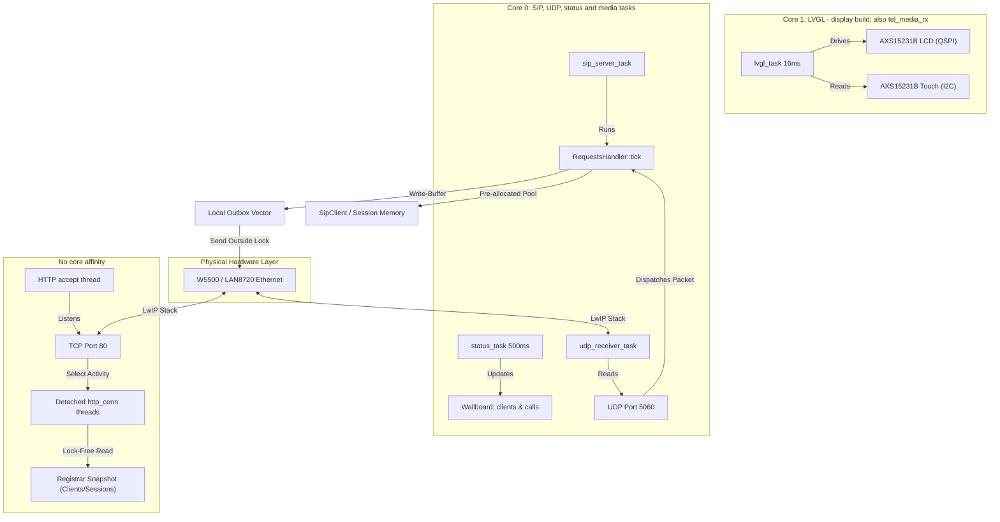

# Pocket-Dial ESP32 Firmware: Deep Architectural Review

This document provides a highly technical, deep architectural analysis of the **pocket-dial** firmware. It reviews the post-refactor system topology, multi-core scheduling paradigm, component communication boundaries, select-based HTTP thread dispatching model, and concurrency optimizations.

## 1. System Topology & Component Overview

**pocket-dial** is an ultra-low-latency, dual-core SIP registrar and back-to-back call broker designed to run on resource-constrained ESP32 and ESP32-S3 microcontrollers. It supports multiple networking interfaces (Wi-Fi SoftAP/Station and SPI/RMII wired Ethernet) and drives smart displays (e.g., JC3248W535) using the LVGL graphics library.

The firmware architecture is divided into three core logical layers:
1. Network Hardware & Driver Layer: controls physical media (Wi-Fi radio, W5500 SPI Ethernet MAC/PHY, LAN8720 RMII PHY) and registers low-level event handlers.
2. Signaling & State Engine Layer (`RequestsHandler`): A lightweight SIP registrar and session controller managing client registration leases, active SIP sessions, and intercom broadcasting/paging features. It implements a deliberately partial subset of RFC 3261: no §16 proxy behaviour (§1.1), but all four §17 transaction machines; §1.2 states which messages they cover, which they deliberately leave out, and where timing and coverage fall short (1 Hz sweep, pool exhaustion).
3. User Interface & Query Layer: consists of a custom select-based, thread-dispatching `HttpServer` serving a retro CGA CRT web dashboard, an mDNS service responder, and a high-frequency LVGL-based GUI display task.

The diagram below shows the **display (JC3248W535) build**, where LVGL runs on Core 1 and
the SIP, UDP and status tasks run on Core 0. On the headless builds (`eth`, `lan8720` and
headless Wi-Fi) there is no `lvgl_task` and both the SIP task and `udp_receiver_task` move
to Core 1 instead. The two are **always co-located** on the same core (`handle()` runs
inline on the receiver task; the receiver's core is `POCKETDIAL_UDP_RX_CORE`, default 1,
overridden to 0 for the display build in `main/CMakeLists.txt:238`), so no build splits
them the way an earlier revision of this diagram did. The HTTP accept loop is a separate,
unpinned thread (§4), not `http_server_task` itself.


```mermaid
graph TD
    subgraph Core 1 [Core 1: LVGL - display build; also tel_media_rx]
        A[lvgl_task 16ms] -->|Drives| B["AXS15231B LCD (QSPI)"]
        A -->|Reads| C["AXS15231B Touch (I2C)"]
    end

    subgraph Core 0 [Core 0: SIP, UDP, status and media tasks]
        D[sip_server_task] -->|Runs| E[RequestsHandler::tick]
        J[status_task 500ms] -->|Updates| K[Wallboard: clients & calls]
        L[udp_receiver_task] -->|Reads| M[UDP Port 5060]
    end

    subgraph Unpinned [No core affinity]
        F["HTTP accept thread"] -->|Listens| G[TCP Port 80]
        G -->|Select Activity| H["Detached http_conn threads"]
        H -->|Lock-Free Read| I["Registrar Snapshot (Clients/Sessions)"]
    end

    subgraph Hardware [Physical Hardware Layer]
        B
        C
        N["W5500 / LAN8720 Ethernet"] <-->|LwIP Stack| L
        N <-->|LwIP Stack| G
    end

    E -->|Pre-allocated Pool| O[SipClient / Session Memory]
    M -->|Dispatches Packet| E
    E -->|Write-Buffer| P[Local Outbox Vector]
    P -->|Send Outside Lock| N
```

### 1.1 Protocol Role: Back-to-Back Call Broker, Not a Proxy

> [!IMPORTANT]
> **`RequestsHandler` is not an RFC 3261 §16 proxy, and the distinction decides
> where the audio goes.** A proxy forwards a request onward along a route set; this
> engine terminates each call leg and originates the next one itself.

The clearest evidence is in what the outbound path never writes:

- **No `Record-Route`, ever.** The header does not occur anywhere in `src/`. The box stays reachable for in-dialog traffic by rewriting `Contact` to point at itself on each leg (`CallForker::buildInviteFork`, `CallForker.cpp:28`), a user agent's mechanism, not a proxy's route set.
- **No `Via` stacking.** Requests the PBX *originates* carry exactly one `Via`, its own, bearing its own branch (`buildInboundInviteFork`, `buildInboundCancelTo`, `ackInboundFinal`; `BlfSubscriptions.cpp:126`; `ParkOrbit.cpp:203`, `:260`; `RegisterBeeper.cpp:75`). The ordinary extension-to-extension INVITE (`CallForker::buildInviteFork`, `CallForker.cpp:22-50`) is not rewritten in that respect at all: it is a verbatim copy of the caller's message with only the Request-URI, `To` and `Contact` replaced, so it reaches the callee carrying the caller's own `Via` with none of ours pushed on top. Responses are generated as a UAS (the request's `Via` echoed back with `received=` / `rport` filled in per §18.2.1, via `sipwire::viaWithReceived`) and are never forwarded upstream by popping a `Via` off a stack.
- **`Max-Forwards` is write-only.** It appears solely as the literal `Max-Forwards: 70` on outbound requests, and is never read, tested or decremented on any inbound path. The §16.6 loop protection a proxy owes the network is therefore absent by construction.
- **`Route` is neither honoured nor stripped.** `SipMessage` has no concept of the header, so a `Route` a phone puts on a request simply rides along inside the relayed copy.

What the engine *is* instead is a forked UAC coupled to a UAS, what `docs/FEATURE_ROADMAP.md` §1.1 calls a **back-to-back call broker**. Two distinct leg shapes share that label, and the difference surfaces in every header a debugger looks at:

- **Legs the PBX originates** (the inbound-trunk fork, park ring-back, register beep, BLF `NOTIFY`) are a fresh UAC: its own `Via` and branch, its own `From`-tag, and a `CSeq` space restarting at 1, while reusing the caller's `Call-ID` (`buildInboundInviteFork`).
- **Ordinary extension-to-extension legs** are the wholesale copy described above, so `From` (tag included), `CSeq` and `Via` all reach the callee exactly as the caller wrote them. Keeping the caller's `Via` is what lets the return path work without a second rewrite: the callee's `180`/`200` already bears the `Via` the caller expects, so the relay hands the `180` back verbatim (`onRinging` → `endHandle`, `RequestsHandler.cpp:4932`) and the `200` with **only its `Contact`** rewritten (`:5785-5788`). The wider `Contact`/`To`/codec rewrite at `:5692-5707` is the **broadcast** branch, taken for the `999` intercom, ring-all and hunt forks (`setBroadcast(true)`, `CallForker.cpp:84`, `:314`).

On both shapes the caller's `Call-ID` spans both legs. That is deliberate rather than sloppy: it is the `_sessions` key, which is how a mid-dialog request arriving from *either* leg resolves to the one session via `getSession(data->getCallID())`. Two legs are the exception: the blind-transfer leg to the target has its **own** Call-ID, linked to the kept A–B session by `setPeerCallID` (`RequestsHandler.cpp:6295-6299`, `:6532`, `:6538`), and the SIP-trunk carrier leg's Call-ID is minted by `SipTrunk` (`SipTrunk.cpp:98`, `:214-215`).

Unlike a textbook B2BUA, it does not insert itself into the media path. SDP is relayed with only unsupported codecs filtered out, so an ordinary extension-to-extension call streams RTP directly phone-to-phone and the board never handles a media packet. The exceptions (`440`, `888`, `555` and outside lines) are tabulated under "Audio: what touches the board, and what doesn't" in the README, which now also lists a parked call with a music-on-hold clip loaded (`ParkOrbit.cpp:64-84` answers the parked leg `sendonly` from the `HoldMusic` port, and `HoldMusic` then transmits to it every 20 ms). **Three more the README table does not list:** the dashboard's MoH preview call (`startMohPreview`, `RequestsHandler.cpp:3363-3433`), which rings an extension purely to play the clip at it; the far side of an **outbound** anchor call a handset puts on hold, which `MediaBridge::setHeld()` feeds from `HoldMusic` as a per-call tap, decoded to PCM16 and written to the anchor (#218; a hold on an **inbound** anchored call goes unanswered, #445, fix #449); and **voicemail** deposit and retrieval (`796`), each leg a board-terminated `RtpReceiver`/`RtpSender` pair (`VoicemailLeg.hpp:10-16`; the deposit is answered by `answerVoicemailDeposit`, `RequestsHandler.cpp:2634`). Park with no clip loaded (the default) still answers `a=inactive` and sources nothing.

### 1.2 Transaction-Layer Scope

`TransactionLayer` implements the full RFC 3261 §17 transaction layer: four
transaction types across two pools (`TransactionLayer.hpp:14-37`). The
**client pool** covers requests this PBX sends and retransmits until
answered; the **server pool** covers responses this PBX authors, kept so a
retransmitted request gets the same answer back and (for INVITE)
retransmitted until it is ACKed. `classify()` is the single router that
decides which of the four a message earns, and it is method- and
authorship-aware rather than blanket: every INVITE **response** this PBX
itself authored becomes an `InviteServer` transaction, `BYE`/`CANCEL`/
`REFER`/`UPDATE` responses it authored become `NonInviteServer`, every
INVITE **request** it sends becomes `InviteClient`, and every other request
it sends — `BYE`, `CANCEL`, `NOTIFY`, `REFER`, `INFO`, `MESSAGE`,
`SUBSCRIBE`, `UPDATE` — becomes `NonInviteClient` (`TransactionLayer.cpp:79-116`).
This landed in PR #226.

Implemented today:

| Mechanism | Where |
| :--- | :--- |
| §17.1.1 INVITE client transaction (Timer A retransmit from `T1` = 500 ms, doubling uncapped; Timer B gives up at 64×T1 = 32 s; a final response then absorbs duplicates under RFC 3261 Timer D — 32 s — for 3xx-6xx or RFC 6026 §8.4 Timer M — 64×T1 — for a 2xx) | `TransactionLayer.cpp:110`, `sweep()`/`sweepOne()`, `matchAndAdvance` (`:406-423`) |
| §17.1.2 Non-INVITE client transaction (Timer E, T1 doubling capped at `T2` = 4 s; Timer F at 32 s; Timer K at `T4` = 5 s) for every non-INVITE request the PBX sends other than `ACK`/`OPTIONS`/`REGISTER` | `TransactionLayer.cpp:101-116` |
| §17.2.1 INVITE server transaction — Timer G/H for a non-2xx final (absorbed afterward under Timer I, `T4`, once ACKed), plus §13.3.1.4 retransmission of a **2xx until ACKed** (RFC 6026 §7.1 Timer L once it is) — for an INVITE response this PBX authored | `TransactionLayer.cpp:79-85`, `:329-349`, `:474-479` |
| §17.2.2 Non-INVITE server transaction (Timer J response cache, no retransmit schedule) for an authored `BYE`/`CANCEL`/`REFER`/`UPDATE` response | `TransactionLayer.cpp:86-98`; sizing rationale in `PoolConfig.hpp:360-381` |
| §17.2.3 duplicate-request suppression: a retransmitted request matching a tracked server transaction is answered from the stored response and the handler is **not** re-run | `TransactionLayer::absorbRetransmittedRequest`, called from `handle()` at `RequestsHandler.cpp:926-932` |
| §17.1.1.3 ACK for a non-2xx final to a PBX-originated INVITE | `ackInboundFinal`, `RegisterBeeper::handleInviteFailure` |
| §18.2.1 `received=` and RFC 3581 `rport` on every response | `sipwire::viaWithReceived` |
| §12.2 To-tag detection routing a re-INVITE onto the hold/resume path | `RequestsHandler::onInvite`, `RequestsHandler.cpp:1660-1665` |
| §11.2 capability discovery (`Allow` / `Supported` / `Accept` / `Allow-Events`) | `addCapabilityHeaders()`, called from four sites: `onRegister`'s 200 OK (`RequestsHandler.cpp:1295`), `onOptions`'s 200 OK (`:1415`), the anchored-media re-INVITE/UPDATE answer shared by `onReinvite()`/`onUpdate()` (`answerAnchorReinvite`, `:8972`), and `buildOkWithSdp()` (`:9650`) for the PBX-authored 2xx it builds: the 888 conference leg (`:2530`), both voicemail legs (deposit `:2775`, retrieval `:2993`) and the 555/anchor handset leg (`:425`, `:4024`). **Not** on the 440 tone 200, the 777 echo 200 or the SIP-trunk handset 200, which are built elsewhere. |

Limitations and deliberate exclusions, worth knowing before debugging a retransmission:

- **Only responses this PBX itself authors get a server transaction.** An ordinary extension-to-extension call has its 200 OK **relayed** verbatim from the callee phone (`authoredHere()`, `TransactionLayer.cpp:55-64`); that phone is the real UAS and is already retransmitting its own 200 under its own transaction layer, so retransmitting it here too would just double the packets on the wire on a loss. This is also why the server pool (`POCKETDIAL_MAX_SERVER_TRANSACTIONS`) is sized so much smaller than the client pool (`POCKETDIAL_MAX_TRANSACTIONS`) — only virtual extensions, anchor/bridge legs and PBX-minted failure responses ever claim one (`PoolConfig.hpp:337-381`).
- **A retransmitted INVITE for a session already `Invited`/`Connected`/`Held` can still be silently dropped**, exactly as it was before this layer existed — but now only in the cases the layer does not cover: an ordinary relayed dialog (no server transaction ever opens for it, per the point above); a PBX-authored provisional such as a ring-group/hunt-group fan-out's own 180 (`CallForker.cpp:89`, `:325`), whose `InviteServer` slot is freed the moment the (relayed) final response goes out rather than waiting around to answer a retransmission (`TransactionLayer.cpp:171-209`); and an authored dialog that has already reached the `Accepted` state, where a retransmission is deliberately **not** answered from the absorb cache (`TransactionLayer.cpp:507-531`) because the automatic 2xx-retransmit timer is expected to be the reliability mechanism there instead. All three fall through to `onInvite()`'s pre-existing "Task 2A" guard, unchanged (`RequestsHandler.cpp:1649-1671`).
- **A 2xx to an INVITE that is never ACKed is not followed up with a BYE.** §13.3.1.4 says the UAS SHOULD tear the dialog down once it gives up retransmitting; this layer instead logs the give-up and frees the slot, leaving the dialog itself untouched — a TU-level decision tracked as a follow-up on #199 (`TransactionLayer.cpp:584-594`).
- **Both pools are fixed-size and degrade rather than block.** When every slot is busy, claiming one fails and the message is still sent once, just with no retransmit/absorb coverage for it — precisely the pre-#226 behaviour for that one message (`TransactionLayer.cpp:251-257` client, `:301-310` server).
- **A message too large to fit `POCKETDIAL_TX_MSG_BYTES`** (1500 bytes, the Ethernet MTU) is stored truncated and is never retransmitted, logged once at claim time so the gap is visible rather than silent (`TransactionLayer.cpp:136-152`).
- **`INFO` is deliberately excluded** from the non-INVITE server set even though a duplicated DTMF digit from a retransmitted `INFO` is a real bug: a 32 s Timer J slot per keypress would dominate the server pool on its own. Tracked separately (`PoolConfig.hpp:374-376`).
- **`OPTIONS` keepalives, outbound `REGISTER`, `ACK`, and relayed responses stay outside this layer by design**, not by gap: loss of an `OPTIONS` probe **is** the liveness signal it exists to produce, `REGISTER` already runs its own §10.2 refresh/retry schedule in `SipRegistrationClient`, and an `ACK` is never a transaction of its own under §17.1.1.3 (`TransactionLayer.hpp:39-63`).
- **Timer granularity is coarser than the RFC's millisecond figures.** `sweep()` is driven from `RequestsHandler::tick()`, which self-throttles to 1 Hz, so a `T1` = 500 ms first retransmit actually lands around 1 s later. This predates the transaction layer and is conservative under §17 — fewer retransmits on the wire, never more (`TransactionLayer.hpp:64-71`).

The practical upshot: INVITE — client and server, including the
2xx-retransmit-until-ACK half a UAS owes under §13.3.1.4 — and the four
non-INVITE methods where re-running the handler on a duplicate does real
damage (`BYE`, `CANCEL`, `REFER`, `UPDATE`) now get RFC-conformant retry and
duplicate suppression, so a single dropped UDP datagram carrying a
PBX-originated `BYE` **is** retried by this engine, the same as a
PBX-originated INVITE. What is left uncovered above is either an
intentional scope boundary (a relayed response, an `OPTIONS` ping,
`REGISTER`, `ACK`) or a specific, logged degrade path (pool exhaustion, an
oversized message, an unACKed 2xx) — not a missing layer.

## 2. Core Task Topology & Affinity Splits

To limit render frame drops and network packet loss, **pocket-dial** pins its real-time SIP, UDP-receive and media tasks away from the LVGL render loop where it can. The split is not strict: `tel_media_rx` shares Core 1 with LVGL, and the HTTP threads and several workers are unpinned (see the IMPORTANT box below).

The system assigns FreeRTOS tasks to specific cores using `xTaskCreatePinnedToCore`:

### Core Affinity Allocation Table

| Task Name | Priority | Core Target (Display) | Core Target (Headless ETH) | Stack Size | Description |
| :--- | :---: | :---: | :---: | :---: | :--- |
| `lvgl_task` | 5 | **Core 1** | *N/A* | 8192 Bytes | Runs the LVGL render loop (`lv_timer_handler()`) every 16 ms (~60 Hz, `esp_main_display.cpp:328`). |
| `sip_server_task` (`sip_server` on eth/lan8720) | 5 | **Core 0** | **Core 1** | 8192 Bytes | Ticks the SIP state engine (`RequestsHandler::tick()`, which self-throttles to 1 Hz) and sweeps expired leases. The headless Wi-Fi build also puts it on Core 1 (`esp_main.cpp:522`). |
| `udp_receiver_task` | 5 | **Core 0** | **Core 1** | **16384 Bytes** | Listens on UDP port 5060, parses incoming packet headers, and dispatches them to the handler. **Not 8 KB**. `RequestsHandler::handle()` runs inline on this task, and the string-heavy message building plus the register-beep UAC and the `440` SDP path together overflowed the old 8 KB allocation (stack-overflow panic). Raised to 16 KB at `UdpServer.cpp:135-158`; the core is `POCKETDIAL_UDP_RX_CORE`. |
| `http_server_task` (`http_dashboard` on eth and lan8720; absent in the display build's captive-portal branch, `esp_main_display.cpp:946-947`) | 4 | **Core 0** | **Core 0** | 8192 Bytes | Starts the HTTP server, whose accept loop runs on its **own unpinned `std::thread`** (spawned in `start()`, `HttpServer.cpp:199`; loop `acceptLoop`, `:202`), then idles in a 1 s OTA-confirm loop. Connection threads are separate (§4). |
| `status_task` | 3 | **Core 0** | *N/A* | 4096 Bytes | Rebuilds the on-screen wallboard (registered clients, active calls) every 500 ms. There is no battery ADC code; `ui_set_battery()` is a no-op (`main/ui/ui.cpp:992-995`). |

Tasks the table above does not cover (name, stack, priority, core), from the `xTaskCreatePinnedToCore` / `xTaskCreate` calls in the tree:

| Task | Stack / prio / core | Purpose |
| :--- | :--- | :--- |
| `rtp_media_tx`, `rtp_media_rx` | 6144 / 6 / Core 0 | Per-leg RTP send and receive (`RtpSender.cpp:256`, `RtpReceiver.cpp:555`) |
| `conf_mix_tick` | 3072 / 6 / Core 0 | The single `888` mix clock (`ConferenceRoom.cpp:252`) |
| `moh_tx` | 6144 / 5 / Core 0 | Music-on-hold pacer (`HoldMusic.cpp:464`) |
| `tel_media_rx` | 6144 / 6 / **Core 1** | Anchor-provider media receive (`TelephonyAnchorClient.cpp:2810`) |
| `cdr_persist`, `cdr_archive`, `vm_archive` | 6144 / 1 / Core 0 | CDR NVS persist, SD CDR archive, voicemail archive writers |
| `log_drain` | 3072 / 1 / Core 0 | Log queue drain + syslog tee, headless builds only |
| `dns_task` / `decay_task` | 4096 / 5 / Core 0; 3072 / 3 / Core 0 | Captive-portal DNS; captive-portal decay (display build) |
| `http_conn` (pthread) | **4096** / – / unpinned | One per HTTP connection, at most 4 at once (§4) |
| `tel_*`, `trunk_dns`, `smtp_worker`, `restart_task`, `ota_reboot`, `heap_probe` | various / unpinned | One-shot or background workers created with no core affinity |

> [!IMPORTANT]
> Task Isolation Design:
> On the smart-display target (JC3248W535), **Core 1** carries `lvgl_task`, and the SIP, UDP-receive, status and media tasks are pinned to **Core 0**. Core 1 is **not** exclusive to LVGL: `tel_media_rx` is pinned there, and the HTTP accept and connection threads and several workers have no core affinity at all, so the scheduler may place them on either core.
> For headless builds, the high-priority SIP task and `udp_receiver_task` are shifted to **Core 1**, leaving **Core 0** to the media tasks, `http_server_task` and background work.

## 3. Concurrency Architecture & Contention Mitigation

High-frequency HTTP polling of the CGA dashboard under production loads can introduce severe lock contention, resulting in UDP packet dropouts. The post-refactor codebase implements three critical architectural patterns to mitigate concurrency bottlenecks.

### A. Snapshotted Registrar Query Model (Issue #48)
Historically, the `HttpServer` queried `RequestsHandler` active client and session collections by directly acquiring the central `_mutex`. This blocked the real-time SIP signaling loop during active JSON generation.

The post-refactor architecture decouples the HTTP control plane from the UDP signaling plane using a double-buffered snapshot model:

1. State Mutation (Real-Time Path): The main SIP signaling engine processes packets and ticks on a dedicated thread, acquiring `_mutex` only during rapid internal state changes.
2. Snapshot Generation: At the end of each periodic tick inside `RequestsHandler::tick()`, the engine constructs a lightweight `RegistrarSnapshot` (`_snapshot`) containing plain STL vectors of active registration strings and call metadata. This is committed to a secondary buffer under a dedicated, short-lived `_snapshotMutex`.
3. Lock-Free Read (HTTP Path): When the `HttpServer` handles a GET request to `/api/status`, it queries `getActiveClients()` and `getActiveSessions()`. These methods acquire only the lightweight `_snapshotMutex` for a fraction of a microsecond to copy the snapshot, completely eliminating lock contention with the active signaling loop.

```
[UDP Receiver Thread]               [RequestsHandler State]              [HTTP Server Thread]
         │                                     │                                  │
         ├─────── Mutate State ───────────────>│                                  │
         │   (Acquires & releases _mutex)      │                                  │
         │                                     │                                  │
         │                                     ├── Update Snapshot ──┐            │
         │                                     │   (Once per second) │            │
         │                                     │<────────────────────┘            │
         │                                     │ (Acquires _snapshotMutex)        │
         │                                     │                                  │
         │                                     │<─────────── GET /api/status ─────┤
         │                                     │    (Acquires _snapshotMutex)     │
         │                                     │                                  │
```

### B. Out-of-Lock Socket Syscalls (Issue #51)
Executing slow blocking socket syscalls (like `sendto`) while holding the internal registrar lock created significant latency spikes. 

The refactored `RequestsHandler::handle` uses an Outbox Pattern:
* When processing an incoming SIP request, any generated responses or call-forwarding invites are accumulated in the `_outbox` member (`std::vector<std::pair<sockaddr_in, std::shared_ptr<SipMessage>>>`), which `drainOutbox()` moves into a local vector while the lock is still held (`RequestsHandler.cpp:1093`, `:8725`).
* The central `_mutex` is released immediately after the state machine logic completes.
* Once the critical section is exited, the thread iterates through that local copy and executes the UDP `sendto` syscalls outside the lock (`:1110`, `:8739`), keeping registrar lock hold times at microsecond-scale.

### C. Static Memory Pools (Issue #53)
Dynamic heap allocations (`new`, `malloc`, `make_shared`) within the hot UDP signaling path are a major cause of memory fragmentation and non-deterministic jitter on embedded targets.

The post-refactor signaling engine implements static memory pre-allocation:
* During initialization, `RequestsHandler` pre-allocates contiguous arrays of `SipClient` and `Session` smart pointers inside the constructor (`_clientPool` of size 32, and `_sessionPool` of size 8).
* In steady-state operation, `allocateClient` and `allocateSession` search these pre-allocated pools to recycle unused objects, without touching the runtime heap. **That is not yet true of every pool:** the SIP message pool and the virtual-peer pool fall back to the heap when drained (`SipMessagePool.cpp:95-100`, `RequestsHandler.cpp:9722`; #409, with #434 and the #284 batches in flight).
* If the pool is exhausted under heavy load, the server reuses the first expired client registration lease it finds (`allocateClient`, `RequestsHandler.cpp:8808-8816`; not necessarily the oldest) or returns `503 Service Unavailable`, protecting the core heap from out-of-memory (OOM) silent panics.

## 4. Select-Based HTTP Server Thread Dispatch Model

To prevent slow-client TCP connections from stalling the main HTTP accept thread, the `HttpServer` employs a select-monitored, multi-threaded worker dispatch model.

```
       [Main HTTP Server Thread]
                   │
         [select() on listen_sock]
                   │
           (Activity Detected)
                   │
         [accept() client socket]
                   │
       ┌───────────┴───────────┐
       ▼                       ▼
 [Spawn std::thread]     [Resume select()]
       │
 [Set SO_RCVTIMEO (5s)]
       │
 [Read body (Max 16KB)]
       │
 [requireAdmin: origin -> session -> CSRF]
       │
 [Send HTTP Response + security headers]
       │
  [Close Socket]
```

### Accept Loop Implementation
1. The main HTTP accept loop runs on its own `std::thread` (`_acceptThread`, spawned at `HttpServer.cpp:199`, loop `acceptLoop` at `:202`) and uses `select()` on the listening socket with a `250ms` timeout to periodically yield execution and verify if the server is still running.
2. Upon activity, `accept()` is called to retrieve the client socket.
3. **At most 4 connections are served at once** (`kMaxConcurrentConnections`, `HttpServer.hpp:64`); a fifth gets `503` and is closed (`HttpServer.cpp:308-331`).
4. Otherwise the server dispatches client processing to a detached `std::thread` (the spawn is wrapped in `try`/`catch`), instantly freeing the accept thread to monitor subsequent connections. Connection threads are named `http_conn` and get a **4096-byte** stack via `esp_pthread_set_cfg` (`kHttpConnStackBytes`, `HttpServer.cpp:224-231`), not the 8192-byte pthread default.

### The Admission Gate (`requireAdmin`)
Every non-public endpoint passes through one function rather than open-coding its own
checks, in this order:

1. **Same-origin.** `Origin` host vs `Host`. A request with **no** `Origin` header is
   admitted by design, because `curl`, native clients and the CI smoke suite do not send
   one. That is exactly why step 3 exists: the origin check is a browser-only control and
   cannot stand alone.
2. **Session.** A valid `pd_session` cookie, **always**. There is no longer an
   "unprovisioned, admit everyone" bypass: the device ships with a default login credential
   precisely so this check can be unconditional from the first boot (`HttpServer.cpp:3275-3288`,
   `docs/THREAT_MODEL.md` S-1).
3. **CSRF.** For mutating requests, a matching `X-CSRF` token bound to that session. It is
   rendered into the dashboard document and returned by login, never set as a cookie: the
   browser attaches a cookie to a same-site request on its own, so only a value our own
   script has to read and echo back proves the request came from our page.
4. **Forced initial setup.** Until the default credential is replaced, every admin route
   except the one that replaces it answers `403 setup_required` (`HttpServer.cpp:3304-3308`).
5. **Role.** Owner-only actions (factory reset, OTA upload, the encrypted config export, the
   coredump download `GET /api/coredump` at `:782`, `POST /api/admin/set-owner-credential` at
   `:1084`, and the DTMF-PIN route at `:4021`) require an owner session; a sysop session is
   admitted only while no owner credential has ever been set (`HttpServer.cpp:3317-3321`, #173).
   `POST /api/ota/reboot` is sysop-level (`:1109-1115`).

**Why it is centralised.** These three checks used to be copy-pasted at roughly fifteen
routes, and two had drifted: `POST /api/configuring` had no gate at all, and `/api/pcap`,
`/api/trace` and `/api/diagnostics/pcap` had no same-origin check despite serving raw SIP
message bytes including `Authorization` digests. A single gate makes "forgot to gate this
route" a structural impossibility rather than a review question.

Responses carry CSP, `X-Frame-Options`, `X-Content-Type-Options`, `Cache-Control: no-store`
and `Referrer-Policy: same-origin` from one place, `buildResponseHead()`
(`HttpServer.cpp:1228-1260`, called by `sendResponseWithHeader`), for the same reason.
There is deliberately no HSTS. This is plain HTTP on a LAN appliance, and pinning it would
make the device permanently unreachable over `http://`.

### Worker Protection & Robustness (Issue #23)
* Slowloris protection, **partial**: the worker thread sets a 5-second socket receive timeout (`SO_RCVTIMEO`, `HttpServer.cpp:390-393`), which ends a connection that goes silent. It is **per `recv()`**, though: the buffered body loop (`:545-556`) has no overall deadline and runs before any auth check, so one unauthenticated host trickling a byte every few seconds can hold all 4 connection slots.
* Heap stack safety: Rather than allocating a raw stack-local character buffer, the worker uses a heap-allocated `std::vector<char>` read buffer. Connection threads run on a 4096-byte stack (§ Accept Loop above; the 8192-byte `CONFIG_PTHREAD_TASK_STACK_SIZE_DEFAULT` in `sdkconfig.defaults` applies to other pthreads), so a 4 KB stack-local buffer would consume the whole thread's stack before any handler ran.
* Buffer overflow cap: The worker parses the `Content-Length` header and enforces a maximum payload limit of **16 KB** (16,384 bytes). If a client attempts to upload a larger body (e.g., in a malicious POST flood to `/api/wifi/connect`), the worker immediately responds with `413 Payload Too Large` and aborts the connection, securing the target's RAM.

## 5. Security & Network Protections

### Same-Origin Policy & CSRF Prevention (Issue #28 / #38)
Because the device serves as a local captive portal or open access point, malicious scripts running in background browser tabs on connected clients could attempt to trigger administrative side-effects (such as disconnecting users or reconfiguring Wi-Fi).

To prevent Cross-Site Request Forgery (CSRF), the server implements a **Same-Origin Check** inside `HttpServer::isSameOrigin`:
* If an incoming state-mutating POST request (`/api/kill`, `/api/wifi/connect`, `/api/wifi/mode_ap`) contains an `Origin` header (sent by modern browsers during cross-site requests), the server extracts the host domain.
* The server compares the `Origin` host string directly with the `Host` header sent by the client.
* If they do not match, the request is immediately rejected with `403 Forbidden` (`{"error":"cross-origin request rejected"}`).
* No wildcard `Access-Control-Allow-Origin: *` headers are ever returned on API routes, preventing cross-origin browser reads of active registration profiles.

### Per-Source-IP Token Bucket Rate Limiting (Issue #38)
To protect the registrar from UDP flood denial-of-service (DoS) attacks, the `RequestsHandler` integrates a thread-safe token bucket rate limiter:
* Sustained/burst thresholds: UDP packets are evaluated using a per-source IP token bucket with a default burst depth of **40 packets** and a sustained replenishment rate of **20 packets per second**.
* Where it runs: **after** parsing, not before. `SipServer::onNewMessage` fully parses the datagram (`SipServer.cpp:76`) and `handle()` rejects a structurally invalid message (`RequestsHandler.cpp:802`) before the rate check (`:816-825`). The check does run before the central `_mutex`, under its own `_rateMutex`, so a flood never contends with call processing. If an IP exceeds its burst threshold, the packet is discarded and the atomic `_packetsDropped` counter is incremented. The 40/20 figures are inline literals (`:8858`, `:8867`).
* Bounded table: at most **256** buckets; a new source IP arriving when the table is full is dropped outright (`:8852-8856`).
* Eviction cycle: To prevent memory leak accumulation from transient spoofed IPs, buckets idle for 60 s are evicted from `tick()` (`:8617-8632`).
* **Subnet CIDR Filtering is NOT AVAILABLE. Do not plan a deployment around this.** Earlier revisions of this document said the registrar could be compiled with `-DPOCKETDIAL_ALLOW_CIDR="192.168.1.0/24"` to reject traffic from outside a segment. **No such macro exists anywhere in the tree.** The only occurrence of that name in the repository was this sentence. The matching runtime state does exist but is inert: `_allowNet` / `_allowMask` (`src/SIP/RequestsHandler.hpp:2073-2075`) are initialised to `0` and **never assigned by any code path**. There is no setter, no constructor argument, no HTTP route and no NVS key. `RequestsHandler::ipAllowed()` (`RequestsHandler.cpp:8837-8842`) therefore takes its `if (_allowMask == 0) return true;` early exit on every packet, so **every source IP is allowed, always**. The token bucket above is real and does run; the subnet filter is scaffolding that was never wired up. Segment isolation has to come from the network (VLAN, firewall, or simply not routing the board's link), not from this firmware.
