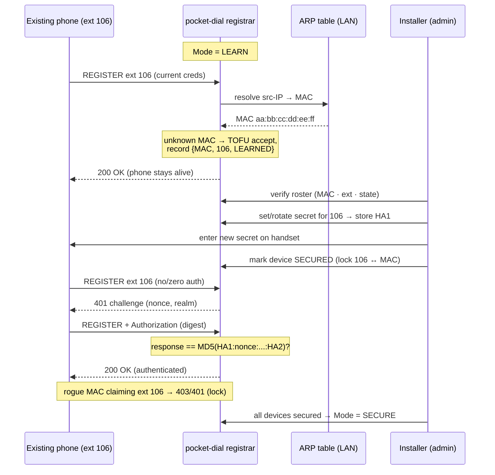

# Learn Mode: Fleet-Cutover Runbook

Status: Shipped on `main` (digest auth + Learn mode), and operator-selectable from the dashboard, `POST /api/registrar`, or the flash-time `cfgseed` seed. The seed route works from **v1.4.1** onward; on v1.3.0 and v1.4.0 it silently did nothing ([#151](https://github.com/GlomarGadaffi/pocket-dial/issues/151)). The default depends on the board (#397): a **fresh install boots in `learn`**; an **existing board upgraded with no stored mode keeps `open`**, written to NVS once by the schema v2 migration so it shows as a real setting; a **factory reset returns the board to `learn`**. If the mode can't be read or saved, the board boots `learn`, never `open` (#441). A stored mode (dashboard, API or `cfgseed`) always wins. | Audience: Installers / field operators converting an existing phone deployment to pocket-dial. | Scope: Operational runbook, not implementation spec.

> **TL;DR.** Learn mode lets you drop pocket-dial into a *running* phone deployment and
> adopt the handsets that are already there, without re-typing a SIP account into every
> phone. The phones keep working on their current credentials (trust-on-first-use, keyed by
> device **MAC**), you then issue new secure secrets per extension from the config panel and
> flip each device, or the whole box, to **Secure**, which locks every extension to the
> MAC that claimed it. The honest boundary: Learn mode trusts the LAN. Run the adoption
> window short, admin-initiated, on a trusted/WPA2 link. See
> [THREAT_MODEL.md](THREAT_MODEL.md) §9 (Learn-mode auth surface) and
> [FEATURE_ROADMAP.md](FEATURE_ROADMAP.md) §3.3 (SIP digest auth).

## 1. The three registrar modes

The registrar mode is a runtime setting (NVS-backed, chosen at onboarding and changeable
from the dashboard's *Extension Registration & Onboarding* panel, or `POST /api/registrar`).
It controls how a REGISTER is treated.

There are two routes to it, and which one you want depends on whether the board is already
on a network you can reach:

- **The dashboard** (*Extension Registration & Onboarding* panel, or `POST /api/registrar`
  directly) works for any board you can reach over HTTP. **The dashboard is always reachable
  on its port.** The HTTP listener opens at boot and never closes; there is no
  dark-by-default admin plane and no `*4887` star-code to reopen one; both were removed,
  along with the bounded admin-open window and `POST /api/admin/keepalive`. If the
  dashboard refuses your connection, that is a genuine fault (wrong address, wrong
  network, or a board that never finished booting), not a gate you need to open. You do
  need to **log in**, and on an unclaimed board you must replace the default credential
  first (see §3, Step 0).
- The browser flasher's flash-time configuration panel: the only way to pick a mode
  *before first boot*, which matters on a headless board you are about to deploy somewhere
  you would rather not visit twice.

> [!IMPORTANT]
> **That panel only works from firmware v1.4.1 onward.** On v1.3.0 and v1.4.0 the seed's
> `regMode` was written to NVS namespace `storage` while `Registrar::loadMode()` reads
> `pbxcfg`, so it silently did nothing ([#151](https://github.com/GlomarGadaffi/pocket-dial/issues/151)). If you seeded a mode at
> flash time on one of those builds the board came up `open` regardless. Check
> `GET /api/registrar` rather than assuming.

| Mode | What it does | When to use it |
|------|--------------|----------------|
| **Open** (`0`, standalone) | No SIP authentication. Any phone that knows an extension can REGISTER and place calls. The default kept on an existing board that had no stored mode when it was upgraded past #397 (fresh boards and factory resets start in Learn). | Bench testing, a brand-new isolated deployment you will secure immediately, or a fully trusted/closed lab. **Not** for production on a shared link. |
| **Learn** (`1`, TOFU adoption) | Adopts unknown phones on first REGISTER **without verifying** (trust-on-first-use), records `{MAC, extension}`, and keeps them alive on their *current* credentials. Already-secured devices are still digest-challenged. A different MAC claiming a secured extension is rejected. | **The cutover mode.** Use it only during a bounded adoption window while migrating an existing fleet, then leave it. |
| **Secure** (`2`, closed) | Every REGISTER is digest-challenged (RFC 2617, MD5). Only extensions whose secret you have set/rotated can register, and each is locked to its adopted MAC. | **Steady-state production.** The target you flip to once the fleet is adopted and secrets are issued. |

Mode transitions are explicit admin actions: there is no silent downgrade. Moving
Secure → Open/Learn re-opens the registrar and is logged; do it only deliberately. See
[THREAT_MODEL.md](THREAT_MODEL.md) §9 (no-silent-downgrade).

## 2. How a phone's MAC is obtained (read this first)

Phones **do not put their MAC in SIP**. The SIP `User-Agent` header carries only a
firmware/model string, and there is no MAC anywhere in the REGISTER. pocket-dial resolves
the phone's MAC by looking up the REGISTER's **source IP in the LAN ARP table**
(IP → MAC, via the device's own network interface).

Two consequences you must plan around:

- **LAN-only.** ARP resolution works only for devices on the same L2 segment as
  pocket-dial. A phone reaching the registrar through a router (different subnet) has no
  ARP entry here and **cannot be MAC-adopted**. Keep the phones and the box on one flat
  segment during cutover.
- **First-packet timing caveat.** The ARP entry for a phone may not exist yet on its
  *very first* packet. pocket-dial resolves the MAC a beat later (after the initial
  exchange / keepalive `OPTIONS`) and retries; a phone can therefore show up momentarily as
  adopted-without-MAC and resolve on the next registration cycle. **Corrected: that state
  cannot occur.** On an ARP miss `admitLearn()` accepts the REGISTER but adopts *nothing*
  (`Registrar.cpp:145-153`), and the MAC is the device map's key (`Registrar.hpp:126`), so a
  row with a blank MAC cannot exist; the phone is simply **absent** from the roster until a
  cycle where ARP resolves. Wait one registration interval and re-check; look for a missing
  row, not a blank one.

Implication for the lock: because the lock is keyed on a MAC learned from ARP, it is a
*trust-the-LAN* control, not a cryptographic one. ARP/MAC can be spoofed on a hostile L2.
The lock raises the bar; **WPA2 / a trusted LAN is the real boundary.** This is stated
plainly in [THREAT_MODEL.md](THREAT_MODEL.md) §9.

## 3. The cutover sequence

> Do this on a **trusted link** (ideally WPA2 on the SoftAP, or a trusted wired segment),
> with the box's admin credential already claimed. Keep the adoption window short.

### Step 0: Prepare
- [ ] pocket-dial powered, on the **same L2 segment** as the existing phones.
- [ ] **Admin credential claimed.** The board ships with a known default login
      (`admin`/`admin`) and refuses every other admin action, including
      `GET /api/registrar`, with `403 {"error":"setup_required"}` until you replace it
      via `POST /api/admin/set-credential`. Log in with the default, set a real
      username + password (8-character minimum), and only then touch the registrar. See
      [ONBOARDING.md](ONBOARDING.md). *(This is a login credential, not a PIN; the
      numeric DTMF PIN is a separate, optional secret for the phone-keypad admin menu and
      is not involved in any of this.)*
      On the `wifi`, `eth` and `lan8720` builds this is not optional in a second sense:
      the SIP stack is held down at boot until a credential is committed, so **no phone
      can register and adoption cannot begin** until you have done it. The `display`
      build is deliberately not gated this way.
- [ ] You know the current extension list and which phone is which (you will verify MACs).
- [ ] Link is trusted: WPA2 SoftAP or a segmented/trusted wired LAN. Avoid an open AP for
      the window if you can ([THREAT_MODEL.md](THREAT_MODEL.md) §9, TOFU-window risk).

### Step 1: Drop in and choose Learn
Bring pocket-dial up as the registrar the phones point at (point the phones' SIP server at
the box, or take over the address the old registrar held). At onboarding, choose **Learn**
as the registrar mode (writes `reg_mode = 1`).

### Step 2: Phones adopt on first REGISTER (TOFU)
As each phone's registration refreshes, it REGISTERs to pocket-dial. In Learn mode an
**unknown MAC** is accepted **without credential verification** and recorded as
`{MAC, extension, state = LEARNED}`. The phone keeps working on whatever credentials it
already had; you have not changed the handset yet. This is the trust-on-first-use step:
the box trusts the first device to claim an extension on the LAN.

> Registrations refresh on the phones' own expiry cycle. You can reboot a phone (or trigger
> "re-register") to adopt it immediately rather than waiting for its lease to lapse.

### Step 3: Verify the adopted roster
Open the **devices / registrar view on the web dashboard**. It is reachable at any time
(the listener is never gated; see [THREAT_MODEL.md](THREAT_MODEL.md) §5.5), you just need
a logged-in session, and `GET /api/registrar` is one of the reads that requires one.
Confirm every expected phone appears with the right **MAC · extension ·
state** (`LEARNED` / `ONLINE`). **This is the trust-on-first-use checkpoint: verify it
before you secure anything.** If a MAC is blank, see §2 (first-packet caveat); wait one
cycle. If an *unexpected* MAC adopted an extension, you have a rogue/duplicate device on
the segment. Stop, investigate, and forget it (§6) before proceeding.

### Step 4: Assign / rotate per-extension secrets

> [!CAUTION]
> **STOP. This step cannot be carried out on any current build, and the two steps after
> it depend on it.** There is **no way to set a per-extension SIP secret**.
> `SipSecretStore::setSecret()`, `generateSecret()` and `clearSecret()`
> (`src/Helpers/SipSecretStore.cpp:171,230,307`) have **zero callers** outside the test
> suite. There is no HTTP route (the full route table is `HttpServer.cpp:457-760`), no
> field on the dashboard (the only "secret" input in `index_html.h` is the 3CX
> telephony API key), no serial console, and `cfgseed` cannot carry one (its flag set
> is apSecure / apPsk / wifiMode / staCreds / regMode only,
> `DeviceConfig.hpp:167-180`).
>
> The consequences follow all the way down:
> * `Registrar::secure()` refuses and only logs when the extension has no secret
>   (`Registrar.cpp:251-256`), so **Step 5 cannot mark any device Secured**; the API
>   answers `404 {"error":"no adopted device matches that MAC or extension"}`, which
>   names the wrong cause.
> * `admitSecure()` rejects every REGISTER with *Extension Not Provisioned*
>   (`Registrar.cpp:99-105`), so **flipping `reg_mode = 2` locks out the entire fleet**
>   rather than securing it. The `409` guard on `POST /api/registrar mode=secure`
>   (`HttpServer.cpp:2522-2541`) exists precisely to stop you doing this, and it will
>   refuse unless you override it with `confirm=LOCKOUT`. **Do not override it.**
>
> The digest machinery itself is real and host-tested: `SipDigest`, the HA1 store, the
> challenge path on both REGISTER and INVITE. What is missing is the one operator-facing
> write path. Until it exists, `learn` mode (TOFU + MAC lock) is the strongest admission
> mode that can actually be deployed, and this runbook stops at Step 3.

*The rest of this section describes the intended design, for whoever wires up that write
path, not a procedure you can follow today.*

For each extension, **set or rotate a secret** from the config panel (M1: manual, on the
web dashboard; M2 auto-reprovision is later; see §7). The box stores
**HA1 = MD5(extension : realm : secret)** per extension, the recoverable-equivalent digest
credential, **not** a one-way hash (digest auth requires the server to be able to recompute
the response). Then put that secret on the matching handset (type it into the phone's web UI
for M1).

> The HA1 in NVS is a **bearer credential at rest**; anyone who can read it can authenticate
> as that extension. This pairs with the flash-encryption / Secure Boot item already tracked
> in [THREAT_MODEL.md](THREAT_MODEL.md) (§7 P2). Do not export or log secrets.

### Step 5: Flip to Secure (per device, then the box)

> [!CAUTION]
> Blocked by Step 4: no device can be marked Secured while there is no way to set a
> secret, and flipping the box to `reg_mode = 2` in that state is a full fleet lockout,
> not a hardening step. Read Step 4's box before doing anything here.

Mark each adopted device **Secured** once its new secret is on the handset and it
digest-authenticates cleanly. A secured device is now locked to its MAC: a REGISTER for
that extension from a *different* MAC is rejected (`403`/`401`). When every device is
secured and verified, flip the **registrar mode to Secure** (`reg_mode = 2`) so the
whole box challenges every REGISTER and no new unverified phone can be adopted.

### Lock semantics (what "Secured" enforces)
- **Extension ↔ MAC binding.** A secured extension answers only to its adopted MAC. A
  different MAC claiming it is rejected; this is the anti-spoof lock.
- **Digest required.** A secured device must present a valid digest response computed from
  its secret. Wrong/absent secret → challenge/reject, never silent accept.
- **Learn no longer applies to it.** Even while the box is still in Learn mode, an
  already-secured device is digest-enforced (Learn's TOFU acceptance applies only to
  *unknown* MACs).

## 4. Sequence diagram (Learn-mode cutover)



ASCII fallback:

```
 PHONE (ext 106)            pocket-dial (LEARN)            INSTALLER
     |  REGISTER (current creds)  |                            |
     |--------------------------->| src-IP -> ARP -> MAC        |
     |                            | unknown MAC: TOFU accept    |
     |   200 OK (stays alive)     | record {MAC,106,LEARNED}    |
     |<---------------------------|                            |
     |                            |<--- verify roster ---------|
     |                            |<--- set/rotate secret -----| store HA1=MD5(106:realm:secret)
     |<------ enter new secret ---|----------------------------|
     |                            |<--- mark SECURED (lock) ---|
     |  REGISTER (no auth)        |                            |
     |--------------------------->| 401 challenge              |
     |<------ 401 (nonce) --------|                            |
     |  REGISTER + Authorization  |                            |
     |--------------------------->| verify digest vs HA1       |
     |<------ 200 OK -------------|                            |
     |                            |<--- all secured: Mode=SECURE
   (rogue MAC for ext 106 ----> 403/401: extension↔MAC lock)
```

## 5. The TOFU window discipline

Learn mode's trust-on-first-use is a **deliberate, bounded weakening** of the registrar,
not a steady state. During the window any unprovisioned phone that REGISTERs an unclaimed
extension is adopted **without verification**. Treat the window like an open door:

- **Bound it.** Open Learn mode, do the cutover, leave. Do not run a registrar in Learn
  mode indefinitely; that is functionally an open registrar for any *unclaimed* extension.
- **Default on a fresh board, admin-gated after.** Since #397 a fresh install (and a factory
  reset) boots in Learn, because the alternatives are worse out of the box: Open accepts
  anyone, and Secure refuses every phone until secrets exist. Treat that as the start of
  the adoption window above, not a resting state: secure the phones, then leave Learn.
  Re-opening it later is admin-gated.
- **Prefer an encrypted/trusted link.** Run the window on WPA2 (or a trusted wired segment)
  so a passive sniffer can't observe the cutover and a stranger can't associate and race to
  claim an extension. On an open AP the window is materially riskier; see
  [THREAT_MODEL.md](THREAT_MODEL.md) §9 (residual risk if left open).
- **Watch the roster during the window.** A claim you didn't expect = a device you didn't
  authorize. Adopt only what you recognize, then close the window by flipping to Secure.

Residual risk, stated plainly: the lock you get at the end is MAC-based and the MAC is
ARP-derived, strong against accidental collisions and casual spoofing on a trusted LAN,
**not** against a determined attacker on a hostile L2 who can spoof MACs. The real boundary
remains the link (WPA2 / trusted LAN). Learn mode buys you a low-friction cutover; it does
not buy you cryptographic device identity.

## 6. Edge cases, rollback, and forget

### A phone whose MAC changes
The lock is keyed on MAC. If a handset's MAC changes (NIC swap, hardware replacement,
some phones randomize, or a dock/adapter changes the L2 address), a secured extension will
**reject** the new MAC (that is the lock doing its job). To recover:

1. Confirm the change is legitimate (you actually replaced/moved hardware).
2. **Forget** the old adoption for that extension (removes the MAC↔ext binding).
3. Re-adopt: briefly return to **Learn**, let the new MAC claim the extension (TOFU),
   re-issue/rotate the secret, mark Secured again. Then return the box to **Secure**.

A MAC change is indistinguishable, at the registrar, from a different device claiming the
extension, so re-adoption is a deliberate admin action, by design.

### Rollback / forget
- Forget one device: removes its `{MAC, ext}` entry from the device registry
  (`Registrar::forget()`, `Registrar.cpp:275-288`). The extension is then unclaimed and can
  be re-adopted (in Learn) or left unregistered. **It does not remove the HA1.** The digest
  credential lives in a separate NVS namespace (`sipauth`, `SipSecretStore.cpp:25`) and
  survives a forget, so "forget" is not a credential revocation.
- ~~Rotate instead of forget~~: **not available.** There is no rotate path, for the
  same reason Step 4 is blocked: nothing in the firmware calls
  `SipSecretStore::setSecret()`. See the caution box in Step 4.
- Roll the whole box back to Learn/Open: explicit admin mode change (logged, no silent
  downgrade). Reverts to the cutover posture; use only deliberately and re-secure promptly.

## 7. What is M1 vs later (M2)

| Capability | Milestone | Notes |
|------------|-----------|-------|
| Runtime registrar mode (Open/Learn/Secure) | **M1 (now)** | NVS-backed; chosen at onboarding. |
| Digest auth on REGISTER (challenge/verify) | **M1 (now)** | RFC 2617 (MD5); closes the open registrar. INVITE auth (407) is a follow-up. |
| Learn-mode TOFU adoption keyed by MAC | **M1 (now)** | Unknown MAC adopted; recorded `{MAC, ext}`. |
| Extension ↔ MAC lock (anti-spoof) | **M1 (now)** | Different MAC for a secured ext → reject. |
| Set / rotate per-extension secret in config panel | **NOT BUILT** | Listed as "M1 (now)" in earlier revisions; there is no route, no UI field and no console for it; `SipSecretStore::setSecret()` has no production caller. This is the gap that blocks Steps 4-5. |
| **Auto-reprovision** (push new creds to the phone) | **M2 (later)** | Zero-touch cutover via the provisioning HTTP path + `check-sync`. The route shipped as **`GET /config/<mac>.cfg`** (`HttpServer.cpp:461-469`); the `/provision/{mac}.cfg` form named in earlier revisions never existed; see [PROVISIONING.md](PROVISIONING.md). Note it still serves a blank password field, so it cannot complete a credential cutover on its own. |

For M1, **the operator types the rotated secret into each handset.** M2 removes that step by
auto-reprovisioning the phone over HTTP; until then, plan for a touch on each phone's web UI
to deliver the new secret.

## 8. Troubleshooting

| Symptom | Likely cause | Action |
|---------|--------------|--------|
| Phone not adopted; not on roster | Phone hasn't re-registered yet, or it's on a different subnet (no ARP entry) | Reboot/re-register the phone; confirm phone and box are on the **same L2 segment** (§2). |
| Adopted but **MAC is blank** | First-packet ARP miss (§2) | Wait one registration interval; the MAC resolves on the next cycle. Don't secure it until the MAC reads. |
| Phone drops to `401`/`403` after you secured it | New secret not yet on the handset, or typed wrong | Re-enter the secret on the phone; confirm it matches the one you set (rotate again if unsure). |
| A **different MAC** is rejected for an extension | The extension↔MAC **lock** working as designed | If the MAC change is legitimate, **forget** then re-adopt (§6). If not, you have a rogue device. Investigate. |
| Unexpected device appears on the roster during the window | Someone associated and claimed an unclaimed extension (TOFU) | Forget it; tighten the link (WPA2), shorten the window, re-run (§5). |
| New phone won't register after you flipped to **Secure** | Secure mode challenges everything; an un-adopted phone has no secret | Briefly return to **Learn** to adopt it (or set its secret + adopt MAC), then return to **Secure**. |
| Phones work but you suspect eavesdropping during cutover | Open AP: TOFU window and creds observable on the link | Enable **WPA2 on the SoftAP** (the fix with the biggest payoff; [THREAT_MODEL.md](THREAT_MODEL.md) §6) and re-run the window. |

## See also
- [THREAT_MODEL.md](THREAT_MODEL.md) §9, the auth-surface analysis (digest, TOFU window, MAC-lock, secret-at-rest, mode transitions).
- [FEATURE_ROADMAP.md](FEATURE_ROADMAP.md) §3.3, SIP digest auth and WPA2 priorities.
- [PROVISIONING.md](PROVISIONING.md), the per-MAC secret store and the M2 auto-reprovision path.
- [ONBOARDING.md](ONBOARDING.md), first-boot setup and replacing the default admin credential.
